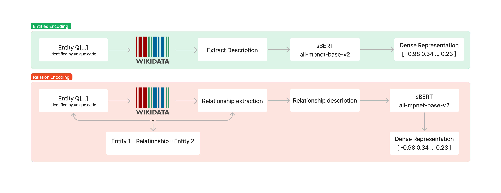

This repository contains the code for the first extension of KRED using the Adressa dataset. The Adressa dataset is a click log dataset from a Norwegian news portal.

## Introduction

In this extension, we explore the essential features for creating and adapting a knowledge-aware document representation, focusing on the Adressa dataset, a click log of news articles. Our primary goal is to preserve the original architecture of the MIND dataset by adapting the Adressa dataset. 

## Data description


We used [SmartMedia Adressa News Dataset](https://reclab.idi.ntnu.no/dataset/).
The Adressa Dataset is a news dataset that includes news articles (in Norwegian) in connection with anonymized users.
Specifically we used the Light version 1: 1.4 GB (compressed) - 1 Week of data collection - 923 articles (in Norwegian

## Model description




The Adressa dataset is a click log of news articles, where each click is associated with a unique hash code. We extract the title, category, subcategory, link, and description of each clicked article and translate the text from Norwegian to English using a shallow multilingual machine translation model called SMaLL-100. The translated text is then used for entity linking using ReFinED, an entity linking system that links entity mentions in documents to their corresponding entities in WikiData. 

To represent each entity and relationship, we query the WikiData portal using the SPARQL protocol and RDF query language to obtain the title and description of each entity. We then use SentenceTransformer with the all-mpnet-base-v2 model to obtain the corresponding embedding, which is a 768-dimensional dense vector space used to represent each embedding. The same procedure is used for relationship encoding. However, due to the large space requirement of loading the entire knowledge graph into memory, we load the embeddings into memory in the form of tensors and apply PCA to reduce the size to 100.

The document vector (DV) is constructed using the SentenceTransformers library and encodes the title and description features of each article using the nb-bert-based model. The model is trained on a machine-translated version of the MNLI dataset and maps title/abstract onto two 768-dimensional dense vector spaces.


##  Running the code

Datasets
[Light version 1: 1.4 GB (compressed) - 1 Week of data collection - 923 articles (in Norwegian), 15.514 users, average article length is 518.6 words](https://reclab.idi.ntnu.no/dataset/one_week.tar.gz)
[Light version 2: 16 GB (compressed) - 10 Weeks of data collection](https://reclab.idi.ntnu.no/dataset/three_month.tar.gz)

Full article content must be requested to the email specified in the dataset page.
1. Extract Light version 1 or 2 to ```adressa/one_week ```
2. Extract content of the article to ```adressa/content_refine ```
3. Run the following notebook
```
$ adressa-Exploration.ipynb  
```
In this version the entity/relationship linking is generated on a different notebook. When asked please run 
```
Entity_Embeddings.ipynb
```
4. Prepare the data for KRED using Adressa DB using the notebook
```
KRED-Data_Preparation.ipynb
```
5. Train the model using 
```
KRED-Model_Train.ipynb
```

